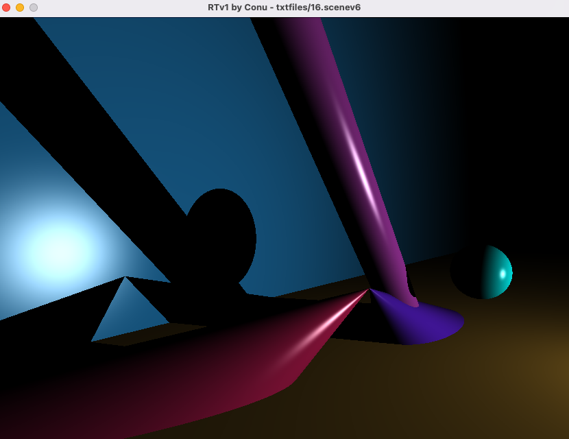

  <a name="readme-top"></a>

<!-- PROJECT LOGO -->
<br />
<div align="center">
  <a href="https://github.com/conu101/Ray-tracer-RTv1">
    
  </a>

  <h3 align="center"> My first ray tracer: RTv1 | 3D rendering of basic shapes and lighting </h3>
  <br />
  <br />
  <br />
  <br />
</div>


<!-- TABLE OF CONTENTS -->
<details>
  <summary>Table of Contents</summary>
  <ol>
    <li>
      <a href="#about-the-project">About The Project</a>
      <ul>
        <li><a href="#built-with">Built With</a></li>
      </ul>
    </li>
    <li>
      <a href="#getting-started">Getting Started</a>
      <ul>
        <li><a href="#installation">Installation</a></li>
      </ul>
    </li>
    <li><a href="#usage">Usage</a></li>
    <li><a href="#roadmap">Roadmap</a></li>
    <li><a href="#contact">Contact</a></li>
    <li><a href="#acknowledgments">Acknowledgments</a></li>
  </ol>
</details>


<!-- ABOUT THE PROJECT -->
## About The Project

  <a href="https://github.com/conu101/Ray-tracer-RTv1">
    
  </a>

Continuing after FdF and Fractol with the graphical library miniLibX, this project marks our entry in the world of 3D rendering of objects and shapes, with different lightings and 
effects for a "real-life" feeling that gives the wow-effect to 3D computed images!


The program displays the following shapes, described in a parameter file called as argument:

* sphere
* cone
* cylinder
* plane

Lighting can be modified through:

* number of spot lights
* position and intensity of light sources
* color of each spot light

As a result, shapes are rendered with shading providing a 3D effect, shadows and specular (shine) effect.

If the program is run without an argument, the correct usage will be displayed in stdout.

The program opens a window and projects an image drawn according to the parameter file called as an argument in the command line. 

The user interface allows the following actions during rendering through keypress:

* move the camera
* select each object individually, move and rotate it in all directions
* select each light, move it and adjust intensity
* modify the parameter file and update rendering without restarting the program.

<a href="https://github.com/conu101/Ray-tracer-RTv1">
    
</a>
Example of parameter file describing a cyan sphere over a purple plane, lit by a spot placed vertically.
  <br />
  <br />
  <br />


<a href="https://github.com/conu101/Ray-tracer-RTv1">
    
</a>
Result rendered with RTv1
  <br />
  <br />
  <br />

The main steps to succeed in the RTv1 project were:

* working on the parsing system to input data shape through a text file. I wanted to keep the file easily human readable while avoiding any seg fault due to incorrect input.
* finding the mathematical formulas for intersection of different shapes.
* implementing the different steps for colorisation of the pixels:
- color due to light
- diffuse color of the object itself
- specular color (shine).
* implementing UI with camera movement, objects and lights manipulation while rendering.


### Built With

* [![C][C.js]][C-url]
* [![VS-Code][VS-Code.js]][VSCode-url]
* [![minilibx][minilibx.js]][minilibx-url]


<!-- GETTING STARTED -->
## Getting Started

The project can be set up locally by downloading or cloning the repository. It has been built on and for macos so its functionality is not guaranteed on other operating systems.

The project required the use of the static library libft.a coded during the previous project. The libft version used in this projct is the version I had put together in that time, much more limited than the currently available version that has been updated since.
See libft project -> [https://github.com/conu101/libft](https://github.com/conu101/libft)

The graphics library minilibx is included in this repository (macos version) and will be compiled with the project by the makefile.

The executable "rtv1" is available in this repo for direct use, but the project can also be recompiled following the steps presented next. If you use the available executable from this repo, ignore steps 4 and 5.

### Installation

1. Open a terminal on your machine

2. Clone the repo
   ```sh
   git clone https://github.com/conu101/Ray-tracer-RTv1.git <your_local_repository>
   ```
3. Get in your new repository
   ```sh
   cd <your_local_repository>
   ```
4. Compile the project using the Makefile
   ```sh
   make
   ```
5. Check that the executable <rtv1> was created and delete the object files
   ```sh
   make clean
   ```
6. Run the executabe with one of the files contained n the <scenes> repository as argument 
	```sh
	./rtv1 scenes/16.scenev6
	```
<p align="right">(<a href="#readme-top">back to top</a>)</p>


<!-- USAGE EXAMPLES -->
## Usage

 Using rtv1

	user@usermachine% ./rtv1 scenes/16.scenev6

At the opening the position and focus point of the camera are defined by the parameters described in the file. In this example the camera is looking at the point of coordinates x, y, z {-16 6 0} of the scene, from the position {-30 6 10}.
  <br />



  <br />
  <br />
  <br />

By modifying the parameter file's line 6 we can modify the position of the camera to look at the scene from the other direction on the x axis, for example from the position {30 4 8}.
Pressing the <space> key wil update the rendering with the new parameters, producing the following image:
  <br />


  <br />
  <br />
  <br />

  More complex scenes can be displayed, with a limit of 1000 chars for the length of the parameter file. For example we can render all shapes combined with 2 spots of different colors (file 17 in scenes):
  <br />


  <br />
  <br />
  <br />

<!-- ROADMAP -->
## Roadmap

- [x] Open window and draw a pixel with minilibx
- [x] Set up the parametr file structure, the parser and manage input error
- [x] Code the 4 different shape intersection formulas
- [x] code rendering functions with pixel colorisation through lights, diffuse and specular colors
- [x] Code the events as hooks
    - [x] from keyboard
    - [x] from update in the parameter file
- [ ] Add refraction and reflection functions
- [ ] Add texture mapping


<!-- CONTACT -->
## Contact

Constance Trouvé - firstname.name(at)gmail.com

Project Link: [https://github.com/conu101/Ray-tracer-RTv1](https://github.com/conu101/Fractol)


<!-- ACKNOWLEDGMENTS -->
## Acknowledgments

Illustrations obtained from "The Noun Project", credits:
* "Marbles" by Magicon from <a href="https://thenounproject.com/browse/icons/term/marbles/" target="_blank" title="Marbles Icons">Noun Project</a>

* "Geometry" by Paweł Gleń from <a href="https://thenounproject.com/browse/icons/term/geometry/" target="_blank" title="geometry Icons">Noun Project</a>

"C", "VSCode" and "mlx" badges from <a href="https://img.shields.io" target="_blank" title="badges">img.shields.io</a>

README template by Othneil DREW from <a href=https://github.com/othneildrew/Best-README-Template target="_blank" title="git">Git_README_template</a>

<p align="right">(<a href="#readme-top">back to top</a>)</p>


<!-- MARKDOWN LINKS & IMAGES -->
<!-- https://www.markdownguide.org/basic-syntax/#reference-style-links -->
[contributors-shield]: https://img.shields.io/github/contributors/othneildrew/Best-README-Template.svg?style=for-the-badge
[contributors-url]: https://github.com/othneildrew/Best-README-Template/graphs/contributors
[forks-shield]: https://img.shields.io/github/forks/othneildrew/Best-README-Template.svg?style=for-the-badge
[forks-url]: https://github.com/othneildrew/Best-README-Template/network/members
[stars-shield]: https://img.shields.io/github/stars/othneildrew/Best-README-Template.svg?style=for-the-badge
[stars-url]: https://github.com/othneildrew/Best-README-Template/stargazers
[issues-shield]: https://img.shields.io/github/issues/othneildrew/Best-README-Template.svg?style=for-the-badge
[issues-url]: https://github.com/othneildrew/Best-README-Template/issues
[license-shield]: https://img.shields.io/github/license/othneildrew/Best-README-Template.svg?style=for-the-badge
[license-url]: https://github.com/othneildrew/Best-README-Template/blob/master/LICENSE.txt
[linkedin-shield]: https://img.shields.io/badge/-LinkedIn-black.svg?style=for-the-badge&logo=linkedin&colorB=555
[linkedin-url]: https://linkedin.com/in/othneildrew
[product-screenshot]: images/screenshot.png
[C.js]: https://img.shields.io/badge/C--programming-C-blue
[C-url]: https://www.w3schools.com/c/c_intro.php
[VS-Code.js]: https://img.shields.io/badge/Visual%20Studio%20Code-VSC-blue
[VSCode-url]: https://code.visualstudio.com/
[minilibx.js]: https://img.shields.io/badge/mlx-MiniLibX-orange
[minilibx-url]: https://harm-smits.github.io/42docs/libs/minilibx
